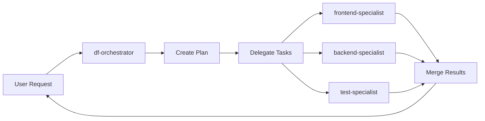

# DroidForge

**Your codebase analyzes itself, then builds its own perfect AI development team.**

DroidForge doesn't give you generic AI assistants. It **understands your codebase** - your languages, frameworks, architecture patterns - and **forges a custom team of specialized AI agents** that speak your project's language. Each droid is an expert in their domain, with deep knowledge of your tech stack.

Built as a Model Context Protocol (MCP) server for Factory.ai's Droid CLI.

[](https://opensource.org/licenses/MIT)
[](https://www.typescriptlang.org/)
[](https://nodejs.org/)

---

## 🎯 The DroidForge Difference

**Most AI coding assistants** give you one general-purpose agent that tries to do everything.

**DroidForge** analyzes your codebase and creates a **custom team of specialists** - each one an expert in a specific aspect of YOUR project:

- A **React expert** who knows your component patterns and state management
- A **backend specialist** who understands your API architecture and database schema
- A **test expert** who writes tests matching your testing framework and patterns
- A **DevOps specialist** who knows your CI/CD and deployment setup

**Each droid is dynamically generated based on what DroidForge discovers in your repository.**

---

## ✨ Key Features

### 🧠 Intelligent Repository Analysis

DroidForge scans your codebase to understand:
- **Languages & Frameworks** (React, Vue, Express, Django, etc.)
- **Architecture Patterns** (MVC, microservices, monorepo, etc.)
- **Tech Stack** (PostgreSQL, Redis, Docker, etc.)
- **Project Type** (web app, API, CLI, library)
- **Testing Strategy** (Jest, Pytest, Cypress)

### 🤖 Dynamic Team Formation

Based on the analysis, DroidForge **creates custom specialists**:
- **Tech-stack aware** - Droids know your specific frameworks and libraries
- **Domain-focused** - Each droid specializes in one area (frontend, backend, testing, etc.)
- **Context-rich** - Understands your project's patterns and conventions
- **Right-sized** - Creates only the specialists you need

### 🎯 Smart Orchestration

The `df-orchestrator` acts as your technical lead:
- **Routes requests** to the most appropriate specialist
- **Coordinates complex tasks** involving multiple droids
- **Manages dependencies** between different parts of work
- **Ensures consistency** across the codebase

### 🔧 Fully Customizable

- **Add specialists** for unique aspects of your project
- **Adjust expertise** as your tech stack evolves
- **Define scopes** for each droid's responsibilities
- **Set guidelines** for code quality and patterns

### ⚡ Efficient Coordination

- **Parallel work** when tasks are independent
- **Safe coordination** prevents file conflicts
- **Progress tracking** shows what each droid is doing
- **Rollback support** if something goes wrong

---

## 🚀 Quick Start

### Installation

```bash
npm install -g droidforge
```

Or build from source:

```bash
git clone https://github.com/Deskwise/DroidForge.git
cd DroidForge
npm install
npm run build
```

### Configuration

Add to your Factory.ai MCP servers configuration:

```json
{
  "mcpServers": {
    "droidforge": {
      "command": "node",
      "args": ["/path/to/DroidForge/dist/mcp/server.js"]
    }
  }
}
```

### First Run

In your Droid CLI session:

```
/forge-start
```

DroidForge will:
1. 📂 Scan your repository
2. 🎯 Ask about your project goal
3. 🤝 Suggest a methodology and droid team
4. ⚙️ Create specialists and orchestrator
5. 📚 Generate documentation

Then use the orchestrator:

```
/df Implement user authentication with JWT
```

See [QUICKSTART.md](QUICKSTART.md) for a detailed walkthrough.

---

## 📖 How It Works

### 1. SmartScan: Understanding Your Project

When you run `/forge-start`, DroidForge performs an intelligent scan:

**Detection:**
- Walks your file tree looking for signals
- Identifies languages (TypeScript, Python, Go, etc.)
- Recognizes frameworks (React, Next.js, Django, FastAPI, etc.)
- Discovers architecture patterns (monorepo, microservices, MVC, etc.)
- Maps your tech stack (PostgreSQL, Redis, Docker, GitHub Actions, etc.)

**Analysis:**
- Determines project type (web app, API, CLI, library)
- Identifies testing strategy (Jest, Pytest, Cypress)
- Understands build system (Webpack, Vite, tsup, etc.)
- Detects deployment approach (Vercel, Docker, AWS)

### 2. Dynamic Team Formation

**Not a template. Each team is unique to your project.**

For a **React + Express + PostgreSQL** project:
```
Your Custom Team:
- df-orchestrator      → Technical lead, coordinates specialists
- frontend-specialist  → Expert in: React 18, TypeScript, Tailwind, Vite
- backend-specialist   → Expert in: Express, Node.js, RESTful APIs, JWT auth
- database-specialist  → Expert in: PostgreSQL, Prisma ORM, migrations
- test-specialist      → Expert in: Jest, React Testing Library, Supertest
```

For a **Python Django + ML** project:
```
Your Custom Team:
- df-orchestrator      → Technical lead, coordinates specialists
- backend-specialist   → Expert in: Django 4, DRF, PostgreSQL, Celery
- ml-specialist        → Expert in: TensorFlow, PyTorch, data pipelines
- api-specialist       → Expert in: REST APIs, serialization, authentication
- test-specialist      → Expert in: Pytest, unittest, Django test tools
```

**Each droid knows:**
- Your specific frameworks and their versions
- Your project's architecture patterns
- Your code organization and conventions
- Your testing and deployment setup
- Best practices for YOUR tech stack

### 3. Intelligent Request Routing

When you ask for something like:
```
/df Add user authentication with JWT tokens
```

The **df-orchestrator** (your technical lead) thinks like a human architect:

1. **Understands the request**: "This needs backend API changes, database models, frontend integration, and tests"

2. **Identifies the right specialists**:
   - Backend specialist: Create User model, auth endpoints, JWT middleware
   - Frontend specialist: Build login/signup forms, auth context, protected routes
   - Test specialist: Write integration and unit tests

3. **Creates a smart plan**:
   - Backend work can start immediately (User model, API)
   - Frontend waits for API completion
   - Tests wait for both to finish

4. **Delegates to specialists** who understand YOUR tech stack:
   - Backend specialist knows you use Express + Prisma
   - Frontend specialist knows your React patterns and state management
   - Test specialist writes tests matching your existing test suite style

5. **Coordinates execution**:
   - Runs independent work in parallel (backend + frontend start together)
   - Ensures dependencies are met (tests wait for APIs)
   - Prevents conflicts (each droid has clear file ownership)

6. **Reports results** with what each specialist accomplished



### 4. Tailored to YOUR Project

The magic is in the details. Each droid doesn't just know "React" - they know:

**Your Frontend Specialist knows:**
- You're using React 18 with hooks
- Your state management is Zustand (not Redux)
- Your styling is Tailwind with custom theme
- Your build tool is Vite, not Create React App
- Your component structure follows atomic design
- Your tests use React Testing Library

**Your Backend Specialist knows:**
- You're on Express 4 with TypeScript
- Your ORM is Prisma, not TypeORM
- Your API follows REST conventions
- You use JWT for authentication
- Your validation is with Zod
- Your tests use Supertest

**This context means they write code that fits your project naturally, not generic code that you have to adapt.**

---

## 🎯 Real-World Examples

### Example 1: Adding Authentication

**Your request:**
```
/df Add user authentication with email/password and Google OAuth
```

**What happens:**

1. **df-orchestrator** understands this touches multiple areas
2. **backend-specialist** (who knows you use Express + Prisma):
   - Creates User model with Prisma schema
   - Builds auth endpoints with bcrypt for passwords
   - Integrates Passport.js for Google OAuth (seeing you use Passport already)
   - Follows your existing API error handling patterns

3. **frontend-specialist** (who knows your React + Zustand setup):
   - Creates login/signup forms matching your design system
   - Adds auth state to Zustand store (consistent with other stores)
   - Implements protected routes using your existing route guard pattern
   - Uses your custom hooks for form handling

4. **test-specialist** (who knows your test setup):
   - Writes Supertest integration tests for API endpoints
   - Creates React Testing Library tests for auth forms
   - Adds E2E tests with Playwright (seeing you use it)
   - Follows your test file organization conventions

**Result:** Authentication that feels like it was built by someone who knows your codebase intimately, because the droids DO know it.

### Example 2: Tech Stack Migration

**Your request:**
```
/df Migrate from REST to GraphQL for the API layer
```

**What happens:**

1. **df-orchestrator** recognizes this is a major architectural change
2. **backend-specialist** (who analyzed your current REST setup):
   - Implements Apollo Server alongside existing Express routes
   - Creates GraphQL schemas based on your current data models
   - Adds resolvers that use your existing service layer
   - Maintains your authentication middleware pattern

3. **frontend-specialist** (who knows your data fetching patterns):
   - Adds Apollo Client to your React app
   - Migrates components from fetch/axios to useQuery hooks
   - Maintains your current loading/error state patterns
   - Updates types to use GraphQL-generated types

4. **test-specialist** (contextually aware):
   - Updates API tests for GraphQL endpoints
   - Adds Apollo MockedProvider to component tests
   - Ensures integration tests cover both REST (legacy) and GraphQL

**Result:** A smooth migration because each droid understands both where you are and where you're going.

### Example 3: New Developer Experience

**Your request:**
```
/df I'm new to this codebase. Add a feature that lets users bookmark articles.
```

**What happens:**

The orchestrator acts as your onboarding buddy:

1. **Analyzes your codebase** and briefs each specialist on relevant patterns
2. **backend-specialist** follows your existing Article model patterns
3. **frontend-specialist** creates a bookmark button matching your design system
4. **test-specialist** writes tests like your existing feature tests

**Result:** Even though YOU'RE new to the codebase, the droids know it well and produce code that fits perfectly.

### Example 4: Multi-Framework Project

Your repository has:
- A React frontend
- A Python Django backend  
- A React Native mobile app

**DroidForge creates:**
- **react-web-specialist** - Knows React 18, Next.js, Tailwind
- **django-specialist** - Knows Django 4, DRF, PostgreSQL
- **mobile-specialist** - Knows React Native, Expo, native modules
- **api-specialist** - Coordinates API contracts between all platforms

When you ask for a feature, the orchestrator coordinates across all platforms while each specialist works in their domain expertise.

---

## 📂 Project Structure

```
DroidForge/
├── src/
│   ├── mcp/                     # MCP server implementation
│   │   ├── server.ts           # Main server entry
│   │   ├── tools/              # MCP tools (forge-*, df)
│   │   ├── prompts/            # Prompt handlers
│   │   ├── execution/          # Execution management
│   │   │   ├── manager.ts      # Execution coordinator
│   │   │   ├── synchronization.ts  # Locks & semaphores
│   │   │   ├── staging.ts      # Isolated work areas
│   │   │   ├── merger.ts       # Atomic merge operations
│   │   │   ├── eventBus.ts     # Real-time coordination
│   │   │   ├── resourceLocks.ts    # File-level locking
│   │   │   ├── resourceMatcher.ts  # Glob pattern matching
│   │   │   ├── deadlockDetector.ts # Deadlock prevention
│   │   │   ├── metrics.ts      # Performance tracking
│   │   │   └── healthCheck.ts  # System health
│   │   ├── generation/         # Droid generation
│   │   └── templates/          # Command templates
│   ├── detectors/              # Repository analysis
│   │   ├── repoSignalsOptimized.ts  # Signal detection
│   │   └── conflictResolver.ts      # Conflict resolution
│   └── types.ts                # TypeScript definitions
├── docs/
│   ├── CLI_SPEC.md             # Complete command reference
│   ├── PARALLEL_ORCHESTRATION.md   # Concurrency details
│   ├── ARCHITECTURE.md         # System architecture
│   └── droid-guide.md          # Droid creation guide
├── templates/                   # Droid templates
├── deployment/                  # Deployment guides
├── archive/                     # Historical documentation
├── README.md                    # This file
├── QUICKSTART.md               # 5-minute guide
├── CONTRIBUTING.md             # Contributor guidelines
├── CHANGELOG.md                # Version history
└── package.json                # NPM configuration
```

---

## 🛠️ Development

### Prerequisites

- Node.js 16+
- TypeScript 5+
- Factory.ai Droid CLI

### Setup

```bash
# Clone the repository
git clone https://github.com/Deskwise/DroidForge.git
cd DroidForge

# Install dependencies
npm install

# Build
npm run build

# Run tests
npm test

# Run in development mode
npm run dev
```

### Testing

```bash
# Unit tests
npm test

# Integration tests
npm run test:integration

# Coverage report
npm run test:coverage

# Watch mode
npm run test:watch
```

### Code Quality

```bash
# Lint
npm run lint

# Format
npm run format

# Type check
npm run typecheck
```

---

## 📚 Documentation

- **[QUICKSTART.md](QUICKSTART.md)** - Get started in 5 minutes
- **[docs/CLI_SPEC.md](docs/CLI_SPEC.md)** - Complete command reference
- **[docs/PARALLEL_ORCHESTRATION.md](docs/PARALLEL_ORCHESTRATION.md)** - Parallel execution details
- **[docs/ARCHITECTURE.md](docs/ARCHITECTURE.md)** - System design and architecture
- **[CONTRIBUTING.md](CONTRIBUTING.md)** - How to contribute
- **[CHANGELOG.md](CHANGELOG.md)** - Version history and changes

---

## 🤝 Contributing

We welcome contributions! Please see [CONTRIBUTING.md](CONTRIBUTING.md) for guidelines.

### Ways to Contribute

- 🐛 Report bugs via [GitHub Issues](https://github.com/Deskwise/DroidForge/issues)
- 💡 Suggest features or improvements
- 📝 Improve documentation
- 🧪 Add tests
- 🔧 Fix bugs or implement features

### Development Workflow

1. Fork the repository
2. Create a feature branch (`git checkout -b feature/amazing-feature`)
3. Make your changes
4. Add tests
5. Run the test suite (`npm test`)
6. Commit your changes (`git commit -m 'Add amazing feature'`)
7. Push to the branch (`git push origin feature/amazing-feature`)
8. Open a Pull Request

---

## 🔒 Security

DroidForge takes security seriously:

- **Isolated Execution:** Each droid works in a staging area
- **Resource Locking:** Prevents unauthorized file access
- **Input Validation:** All user inputs are validated
- **Dependency Scanning:** Regular security audits

See [deployment/SECURITY.md](deployment/SECURITY.md) for security guidelines.

---

## 📜 License

DroidForge is MIT licensed. See [LICENSE](LICENSE) for details.

---

## 🙏 Acknowledgments

- **Factory.ai** for the Droid CLI and MCP infrastructure
- **Contributors** who have helped shape DroidForge
- **Community** for feedback and suggestions

---

## 📞 Support

- **Documentation:** [docs/](docs/)
- **Issues:** [GitHub Issues](https://github.com/Deskwise/DroidForge/issues)
- **Discussions:** [GitHub Discussions](https://github.com/Deskwise/DroidForge/discussions)
- **Community:** [Factory.ai Discord](https://discord.gg/factory-ai)

---

## 💡 Why This Matters

### The Problem with Generic AI Assistants

Generic AI coding assistants are like hiring a contractor who claims they can do everything:
- They don't know YOUR specific frameworks
- They write generic code you have to adapt
- They don't understand YOUR project's patterns
- They can't coordinate complex, multi-area changes

### The DroidForge Solution

**DroidForge is like building your dream development team:**
- Each member is an expert in their specific domain
- They all understand YOUR codebase and tech stack
- They coordinate naturally to handle complex requests
- They produce code that fits seamlessly

**The result:** Code that looks like it was written by someone who's been on your project for months, not by a generic AI.

---

## 🗺️ Roadmap

- [ ] **Enhanced SmartScan** - Detect more frameworks and patterns
- [ ] **Droid Learning** - Droids improve their understanding over time
- [ ] **Visual Team Dashboard** - See your team and their specializations
- [ ] **Multi-Repository Teams** - Coordinate across microservices
- [ ] **Language-Specific Templates** - More specialized droid archetypes
- [ ] **Custom Methodology Support** - Support for custom development workflows
- [ ] **Plugin System** - Extend droid capabilities with custom tools
- [ ] **IDE Integration** - Native support in VS Code, JetBrains IDEs

---

**Ready to build with a team of AI specialists?**

```bash
/forge-start
```

Let DroidForge assemble your perfect development team. 🚀

