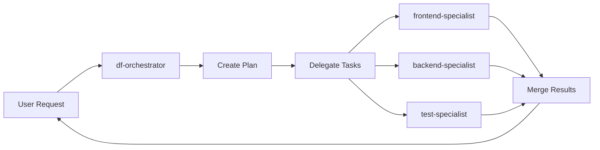

# DroidForge

**Forge a coordinated team of AI specialists for your codebase.**

DroidForge is a Model Context Protocol (MCP) server that analyzes your repository, assembles a team of specialized AI agents (droids), and coordinates their work through an intelligent orchestrator. It provides a seamless experience within the Factory.ai Droid CLI.

[](https://opensource.org/licenses/MIT)
[](https://www.typescriptlang.org/)
[](https://nodejs.org/)

---

## ✨ Features

- **🤖 Intelligent Team Formation:** Analyzes your codebase and suggests specialized droids for your project
- **🎯 Smart Orchestration:** Routes requests to the right specialist and coordinates multi-droid tasks
- **⚡ Parallel Execution:** Runs independent tasks simultaneously with safe resource locking
- **📊 Progress Tracking:** Monitor execution plans, task status, and droid activity
- **🔧 Customizable:** Add custom specialists tailored to your project's needs
- **💾 Snapshot Support:** Create backups before major changes
- **📝 Auto-Documentation:** Generates guides and installs slash commands for your team

---

## 🚀 Quick Start

### Installation

```bash
npm install -g droidforge
```

Or build from source:

```bash
git clone https://github.com/Deskwise/DroidForge.git
cd DroidForge
npm install
npm run build
```

### Configuration

Add to your Factory.ai MCP servers configuration:

```json
{
  "mcpServers": {
    "droidforge": {
      "command": "node",
      "args": ["/path/to/DroidForge/dist/mcp/server.js"]
    }
  }
}
```

### First Run

In your Droid CLI session:

```
/forge-start
```

DroidForge will:
1. 📂 Scan your repository
2. 🎯 Ask about your project goal
3. 🤝 Suggest a methodology and droid team
4. ⚙️ Create specialists and orchestrator
5. 📚 Generate documentation

Then use the orchestrator:

```
/df Implement user authentication with JWT
```

See [QUICKSTART.md](QUICKSTART.md) for a detailed walkthrough.

---

## 📖 How It Works

### 1. Repository Analysis

DroidForge scans your codebase to detect:
- **Languages and frameworks** (TypeScript, React, Python, etc.)
- **Architecture patterns** (MVC, microservices, monorepo)
- **Tech stack** (databases, testing tools, build systems)
- **Project type** (web app, API, CLI tool, library)

### 2. Team Formation

Based on the analysis, DroidForge proposes specialized droids:

```
Your Team:
- df-orchestrator     → Coordinates the team
- frontend-specialist → React, UI/UX, components
- backend-specialist  → API, database, business logic
- test-specialist     → Testing, QA, coverage
- docs-specialist     → Documentation, guides
```

Each droid has:
- **Focused expertise** in their domain
- **File access patterns** for their scope
- **Guidelines** for code quality and style
- **Awareness** of the tech stack

### 3. Orchestrated Execution

The `df-orchestrator` receives requests and:

1. **Analyzes** the request complexity
2. **Creates** an execution plan with dependencies
3. **Delegates** tasks to appropriate specialists
4. **Coordinates** parallel work when safe
5. **Monitors** progress and handles errors
6. **Reports** results



### 4. Safe Parallel Execution

DroidForge coordinates multiple droids working simultaneously:

- **Resource Locking:** Prevents file conflicts with glob-aware locks
- **Staging Areas:** Each droid works in isolated directories
- **Atomic Merging:** Changes are merged safely with conflict detection
- **Deadlock Detection:** Identifies and resolves circular dependencies
- **Event Bus:** Real-time coordination between droids

See [docs/PARALLEL_ORCHESTRATION.md](docs/PARALLEL_ORCHESTRATION.md) for technical details.

---

## 🎯 Use Cases

### Feature Development

```
/df Add a new dashboard page with charts showing user analytics
```

DroidForge will:
- Create the React components (frontend-specialist)
- Build API endpoints (backend-specialist)
- Write tests (test-specialist)
- Update documentation (docs-specialist)

### Refactoring

```
/df Refactor the authentication module to use dependency injection
```

The orchestrator analyzes dependencies and coordinates changes across multiple files.

### Bug Fixes

```
/df Fix the memory leak in the WebSocket connection handler
```

The appropriate specialist investigates, fixes, and adds regression tests.

### Documentation

```
/df Generate comprehensive API documentation from the OpenAPI spec
```

The docs-specialist creates guides, examples, and reference materials.

---

## 📂 Project Structure

```
DroidForge/
├── src/
│   ├── mcp/                     # MCP server implementation
│   │   ├── server.ts           # Main server entry
│   │   ├── tools/              # MCP tools (forge-*, df)
│   │   ├── prompts/            # Prompt handlers
│   │   ├── execution/          # Execution management
│   │   │   ├── manager.ts      # Execution coordinator
│   │   │   ├── synchronization.ts  # Locks & semaphores
│   │   │   ├── staging.ts      # Isolated work areas
│   │   │   ├── merger.ts       # Atomic merge operations
│   │   │   ├── eventBus.ts     # Real-time coordination
│   │   │   ├── resourceLocks.ts    # File-level locking
│   │   │   ├── resourceMatcher.ts  # Glob pattern matching
│   │   │   ├── deadlockDetector.ts # Deadlock prevention
│   │   │   ├── metrics.ts      # Performance tracking
│   │   │   └── healthCheck.ts  # System health
│   │   ├── generation/         # Droid generation
│   │   └── templates/          # Command templates
│   ├── detectors/              # Repository analysis
│   │   ├── repoSignalsOptimized.ts  # Signal detection
│   │   └── conflictResolver.ts      # Conflict resolution
│   └── types.ts                # TypeScript definitions
├── docs/
│   ├── CLI_SPEC.md             # Complete command reference
│   ├── PARALLEL_ORCHESTRATION.md   # Concurrency details
│   ├── ARCHITECTURE.md         # System architecture
│   └── droid-guide.md          # Droid creation guide
├── templates/                   # Droid templates
├── deployment/                  # Deployment guides
├── archive/                     # Historical documentation
├── README.md                    # This file
├── QUICKSTART.md               # 5-minute guide
├── CONTRIBUTING.md             # Contributor guidelines
├── CHANGELOG.md                # Version history
└── package.json                # NPM configuration
```

---

## 🛠️ Development

### Prerequisites

- Node.js 16+
- TypeScript 5+
- Factory.ai Droid CLI

### Setup

```bash
# Clone the repository
git clone https://github.com/Deskwise/DroidForge.git
cd DroidForge

# Install dependencies
npm install

# Build
npm run build

# Run tests
npm test

# Run in development mode
npm run dev
```

### Testing

```bash
# Unit tests
npm test

# Integration tests
npm run test:integration

# Coverage report
npm run test:coverage

# Watch mode
npm run test:watch
```

### Code Quality

```bash
# Lint
npm run lint

# Format
npm run format

# Type check
npm run typecheck
```

---

## 📚 Documentation

- **[QUICKSTART.md](QUICKSTART.md)** - Get started in 5 minutes
- **[docs/CLI_SPEC.md](docs/CLI_SPEC.md)** - Complete command reference
- **[docs/PARALLEL_ORCHESTRATION.md](docs/PARALLEL_ORCHESTRATION.md)** - Parallel execution details
- **[docs/ARCHITECTURE.md](docs/ARCHITECTURE.md)** - System design and architecture
- **[CONTRIBUTING.md](CONTRIBUTING.md)** - How to contribute
- **[CHANGELOG.md](CHANGELOG.md)** - Version history and changes

---

## 🤝 Contributing

We welcome contributions! Please see [CONTRIBUTING.md](CONTRIBUTING.md) for guidelines.

### Ways to Contribute

- 🐛 Report bugs via [GitHub Issues](https://github.com/Deskwise/DroidForge/issues)
- 💡 Suggest features or improvements
- 📝 Improve documentation
- 🧪 Add tests
- 🔧 Fix bugs or implement features

### Development Workflow

1. Fork the repository
2. Create a feature branch (`git checkout -b feature/amazing-feature`)
3. Make your changes
4. Add tests
5. Run the test suite (`npm test`)
6. Commit your changes (`git commit -m 'Add amazing feature'`)
7. Push to the branch (`git push origin feature/amazing-feature`)
8. Open a Pull Request

---

## 🔒 Security

DroidForge takes security seriously:

- **Isolated Execution:** Each droid works in a staging area
- **Resource Locking:** Prevents unauthorized file access
- **Input Validation:** All user inputs are validated
- **Dependency Scanning:** Regular security audits

See [deployment/SECURITY.md](deployment/SECURITY.md) for security guidelines.

---

## 📜 License

DroidForge is MIT licensed. See [LICENSE](LICENSE) for details.

---

## 🙏 Acknowledgments

- **Factory.ai** for the Droid CLI and MCP infrastructure
- **Contributors** who have helped shape DroidForge
- **Community** for feedback and suggestions

---

## 📞 Support

- **Documentation:** [docs/](docs/)
- **Issues:** [GitHub Issues](https://github.com/Deskwise/DroidForge/issues)
- **Discussions:** [GitHub Discussions](https://github.com/Deskwise/DroidForge/discussions)
- **Community:** [Factory.ai Discord](https://discord.gg/factory-ai)

---

## 🗺️ Roadmap

- [ ] Enhanced parallel orchestration with automatic scaling
- [ ] Visual execution dashboard
- [ ] Plugin system for custom tools
- [ ] Multi-repository support
- [ ] Cloud-hosted orchestration
- [ ] Language-specific specialist templates
- [ ] Integration with popular IDEs

---

**Ready to build with a team of AI specialists?**

```bash
/forge-start
```

Let DroidForge assemble your perfect development team. 🚀

