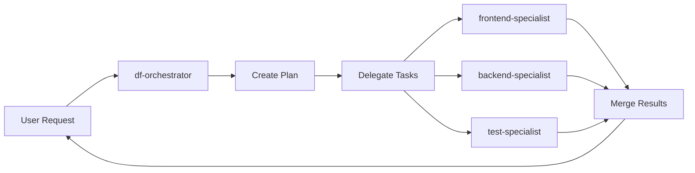

# DroidForge

**Your codebase analyzes itself, builds its own expert development team, then coordinates them to work in parallel—safely.**

DroidForge doesn't give you a generic AI assistant. It **deeply understands YOUR codebase** - your specific frameworks, patterns, and conventions - then **forges a custom team of specialized AI agents** who are experts in YOUR tech stack. The orchestrator identifies work that can happen simultaneously, assigns the right specialist to each task, and coordinates safe parallel execution with intelligent locking, isolated workspaces, and atomic merging.

**Result:** Complex features that used to take hours now complete in minutes, with code that fits your project perfectly.

> **PRODUCTION READY v0.5.0** - Comprehensive safety features, 41/41 E2E tests passing, security reviewed, and performance validated.

Built as a Model Context Protocol (MCP) server for Factory.ai's Droid CLI.

[](https://opensource.org/licenses/MIT)
[](https://www.typescriptlang.org/)
[](https://nodejs.org/)
[](src/mcp/__tests__/e2e/)
[](docs/PRODUCTION_READINESS_REPORT.md)
[](docs/SECURITY_REVIEW.md)

---

## The DroidForge Difference

**Generic AI assistants** give you one agent that tries to do everything sequentially.

**DroidForge** does something fundamentally different:

### 1. Creates Experts in YOUR Project
- Analyzes your codebase to understand YOUR specific tech stack
- Generates custom specialists - each an expert in one aspect of YOUR project
- A **React expert** who knows YOUR component patterns, YOUR state management, YOUR styling
- A **backend specialist** who understands YOUR API architecture, YOUR database, YOUR auth
- Not generic agents - **specialists who speak your project's language**

### 2. Identifies Parallel Work Opportunities
- Analyzes each request to understand what needs to be done
- Intelligently determines which tasks can happen simultaneously
- Recognizes when work is independent (frontend + backend) vs dependent (tests need APIs first)
- Creates smart execution plans that maximize efficiency

### 3. Assigns the Right Expert to the Right Work
- Routes frontend changes to df-frontend who knows YOUR React patterns
- Routes API changes to df-backend who knows YOUR Express setup  
- Routes database changes to df-database who knows YOUR Prisma schema
- Each expert works on what they know best

### 4. Coordinates Safe Parallel Execution (The Secret Sauce)
- **Prevents file conflicts** - Intelligent resource locking ensures no two droids modify the same file
- **Eliminates race conditions** - Each droid works in an isolated staging area
- **Detects conflicts before they happen** - Analyzes what files each task will touch
- **Resolves dependencies** - Ensures Task B waits if it needs Task A's results
- **Tracks progress in real-time** - Know exactly what each specialist is doing
- **Atomic merging** - Changes are merged safely or not at all
- **Automatic rollback** - If something fails, clean recovery

### The Result
Work that used to take hours (waiting for each step to finish) now happens in parallel, safely, with code that fits your project perfectly.

---

## Key Features

### Intelligent Repository Analysis

DroidForge scans your codebase to understand:
- **Languages & Frameworks** (React, Vue, Express, Django, etc.)
- **Architecture Patterns** (MVC, microservices, monorepo, etc.)
- **Tech Stack** (PostgreSQL, Redis, Docker, etc.)
- **Project Type** (web app, API, CLI, library)
- **Testing Strategy** (Jest, Pytest, Cypress)

### Dynamic Team Formation

Based on the analysis, DroidForge **creates custom specialists**:
- **Tech-stack aware** - Droids know your specific frameworks and libraries
- **Domain-focused** - Each droid specializes in one area (frontend, backend, testing, etc.)
- **Context-rich** - Understands your project's patterns and conventions
- **Right-sized** - Creates only the specialists you need

### Smart Orchestration

The `df-orchestrator` acts as your technical lead:
- **Routes requests** to the most appropriate specialist
- **Coordinates complex tasks** involving multiple droids
- **Manages dependencies** between different parts of work
- **Ensures consistency** across the codebase

### Fully Customizable

- **Add specialists** for unique aspects of your project
- **Adjust expertise** as your tech stack evolves
- **Define scopes** for each droid's responsibilities
- **Set guidelines** for code quality and patterns

### ⚡ Battle-Tested Parallel Coordination

The technical innovation that makes safe parallel work possible:

**Intelligent Resource Locking**
- Glob-aware file locking (locks `src/api/**` prevents conflicts across all API files)
- Detects overlapping claims before work starts
- Read vs write lock modes for concurrent reading

**Isolated Execution**
- Each droid works in a private staging area (copy of your repo)
- No race conditions - impossible for droids to interfere with each other
- Changes collected and reviewed before merging to main codebase

**Dependency Resolution**
- Analyzes task dependencies automatically
- Task A must finish before Task B can start
- Detects circular dependencies (deadlocks) before they happen

**Atomic Operations**
- Changes merge completely or not at all
- Conflict detection via content hashing
- Automatic rollback if merge fails
- Snapshot support for major changes

**Real-Time Coordination**
- Event bus for inter-droid communication
- Progress tracking shows exactly what each specialist is doing
- Health monitoring detects stuck or failed tasks
- Metrics track performance and resource usage

**See [docs/PARALLEL_ORCHESTRATION.md](docs/PARALLEL_ORCHESTRATION.md) for technical deep dive.**

---

## 🚀 Quick Start

### Prerequisites

- **Factory.ai Droid CLI** - Required platform (install from [factory.ai](https://factory.ai))
- **Node.js 16+** - For running DroidForge

### Installation

```bash
npm install -g droidforge
```

**That's it!** Commands are immediately available on all platforms. No building, no configuration, no setup.

**✅ Cross-Platform Support**: Windows, macOS, Linux, FreeBSD, OpenBSD

### First Run

**Zero setup required!** Commands work instantly after installation.

In any directory, start your Droid CLI session and type:

```
/forge-start
```

**It just works!** `/forge-start` is available immediately after `npm install`.

DroidForge will guide you through MCP configuration if needed during the onboarding process.

DroidForge will:
1. 📂 Scan your repository
2. 🎯 Ask about your project goal  
3. 🤝 Suggest a methodology and droid team
4. ⚙️ Create specialists and orchestrator
5. 📚 Generate documentation

Then start working:

```
/df Implement user authentication with JWT
```

The `/df` command sends your request to DroidForge, which analyzes it and coordinates your specialist team.

**Available everywhere:**
- `/forge-start` - Begin onboarding or show status
- `/forge-status` - Check your team and recent activity  
- `/forge-guide` - View your team handbook
- `/forge-removeall` - Clean removal when finished
- `/df` - Your orchestrator for coordinating work

See [QUICKSTART.md](QUICKSTART.md) for a detailed walkthrough.

---

## 📖 How It Works

### 1. SmartScan: Understanding Your Project

When you run `/forge-start`, DroidForge performs an intelligent scan:

**Detection:**
- Walks your file tree looking for signals
- Identifies languages (TypeScript, Python, Go, etc.)
- Recognizes frameworks (React, Next.js, Django, FastAPI, etc.)
- Discovers architecture patterns (monorepo, microservices, MVC, etc.)
- Maps your tech stack (PostgreSQL, Redis, Docker, GitHub Actions, etc.)

**Analysis:**
- Determines project type (web app, API, CLI, library)
- Identifies testing strategy (Jest, Pytest, Cypress)
- Understands build system (Webpack, Vite, tsup, etc.)
- Detects deployment approach (Vercel, Docker, AWS)

### 2. Dynamic Team Formation

**Not a template. Each team is unique to your project.**

For a **React + Express + PostgreSQL** project:
```
Your Custom Team:
- df-orchestrator       → Technical lead, coordinates specialists
- df-frontend           → Expert in: React 18, TypeScript, Tailwind, Vite
- df-backend            → Expert in: Express, Node.js, RESTful APIs, JWT auth
- df-database           → Expert in: PostgreSQL, Prisma ORM, migrations
- df-test               → Expert in: Jest, React Testing Library, Supertest
```

For a **Python Django + ML** project:
```
Your Custom Team:
- df-orchestrator       → Technical lead, coordinates specialists
- df-backend            → Expert in: Django 4, DRF, PostgreSQL, Celery
- df-ml                 → Expert in: TensorFlow, PyTorch, data pipelines
- df-api                → Expert in: REST APIs, serialization, authentication
- df-test               → Expert in: Pytest, unittest, Django test tools
```

**Note:** All DroidForge droids use the `df-` prefix. This makes them easy to identify and ensures clean removal when you run `/forge-removeall`.

**Each droid knows:**
- Your specific frameworks and their versions
- Your project's architecture patterns
- Your code organization and conventions
- Your testing and deployment setup
- Best practices for YOUR tech stack

### 3. Intelligent Request Routing

When you ask for something like:
```
/df Add user authentication with JWT tokens
```

The **df-orchestrator** (your technical lead) thinks like a human architect:

1. **Understands the request**: "This needs backend API changes, database models, frontend integration, and tests"

2. **Identifies the right specialists**:
   - Backend specialist: Create User model, auth endpoints, JWT middleware
   - Frontend specialist: Build login/signup forms, auth context, protected routes
   - Test specialist: Write integration and unit tests

3. **Creates a smart plan**:
   - Backend work can start immediately (User model, API)
   - Frontend waits for API completion
   - Tests wait for both to finish

4. **Delegates to specialists** who understand YOUR tech stack:
   - Backend specialist knows you use Express + Prisma
   - Frontend specialist knows your React patterns and state management
   - Test specialist writes tests matching your existing test suite style

5. **Coordinates execution**:
   - Runs independent work in parallel (backend + frontend start together)
   - Ensures dependencies are met (tests wait for APIs)
   - Prevents conflicts (each droid has clear file ownership)

6. **Reports results** with what each specialist accomplished



### 4. Tailored to YOUR Project

The magic is in the details. Each droid doesn't just know "React" - they know:

**Your Frontend Specialist knows:**
- You're using React 18 with hooks
- Your state management is Zustand (not Redux)
- Your styling is Tailwind with custom theme
- Your build tool is Vite, not Create React App
- Your component structure follows atomic design
- Your tests use React Testing Library

**Your Backend Specialist knows:**
- You're on Express 4 with TypeScript
- Your ORM is Prisma, not TypeORM
- Your API follows REST conventions
- You use JWT for authentication
- Your validation is with Zod
- Your tests use Supertest

**This context means they write code that fits your project naturally, not generic code that you have to adapt.**

---

## 🎯 Real-World Examples

### Example 1: Adding Authentication

**Your request:**
```
/df Add user authentication with email/password and Google OAuth
```

**What happens:**

1. **DroidForge** analyzes the request and understands this touches multiple areas
2. **df-backend** (who knows you use Express + Prisma):
   - Creates User model with Prisma schema
   - Builds auth endpoints with bcrypt for passwords
   - Integrates Passport.js for Google OAuth (seeing you use Passport already)
   - Follows your existing API error handling patterns

3. **df-frontend** (who knows your React + Zustand setup):
   - Creates login/signup forms matching your design system
   - Adds auth state to Zustand store (consistent with other stores)
   - Implements protected routes using your existing route guard pattern
   - Uses your custom hooks for form handling

4. **df-test** (who knows your test setup):
   - Writes Supertest integration tests for API endpoints
   - Creates React Testing Library tests for auth forms
   - Adds E2E tests with Playwright (seeing you use it)
   - Follows your test file organization conventions

**Result:** Authentication that feels like it was built by someone who knows your codebase intimately, because your specialists DO know it.

### Example 2: Tech Stack Migration

**Your request:**
```
/df Migrate from REST to GraphQL for the API layer
```

**What happens:**

1. **DroidForge** recognizes this is a major architectural change
2. **df-backend** (who analyzed your current REST setup):
   - Implements Apollo Server alongside existing Express routes
   - Creates GraphQL schemas based on your current data models
   - Adds resolvers that use your existing service layer
   - Maintains your authentication middleware pattern

3. **df-frontend** (who knows your data fetching patterns):
   - Adds Apollo Client to your React app
   - Migrates components from fetch/axios to useQuery hooks
   - Maintains your current loading/error state patterns
   - Updates types to use GraphQL-generated types

4. **df-test** (contextually aware):
   - Updates API tests for GraphQL endpoints
   - Adds Apollo MockedProvider to component tests
   - Ensures integration tests cover both REST (legacy) and GraphQL

**Result:** A smooth migration because each specialist understands both where you are and where you're going.

### Example 3: New Developer Experience

**Your request:**
```
/df I'm new to this codebase. Add a feature that lets users bookmark articles.
```

**What happens:**

DroidForge acts as your onboarding buddy:

1. **Analyzes your codebase** and briefs each specialist on relevant patterns
2. **df-backend** follows your existing Article model patterns
3. **df-frontend** creates a bookmark button matching your design system
4. **df-test** writes tests like your existing feature tests

**Result:** Even though YOU'RE new to the codebase, your specialists know it well and produce code that fits perfectly.

### Example 4: Multi-Framework Project

Your repository has:
- A React frontend
- A Python Django backend  
- A React Native mobile app

**DroidForge creates:**
- **df-react-web** - Knows React 18, Next.js, Tailwind
- **df-django** - Knows Django 4, DRF, PostgreSQL
- **df-mobile** - Knows React Native, Expo, native modules
- **df-api** - Coordinates API contracts between all platforms

When you ask for a feature, DroidForge coordinates across all platforms while each specialist works in their domain expertise.

---

## 📂 Project Structure

```
DroidForge/
├── src/
│   ├── mcp/                     # MCP server implementation
│   │   ├── server.ts           # Main server entry
│   │   ├── tools/              # MCP tools (forge-*, df)
│   │   ├── prompts/            # Prompt handlers
│   │   ├── execution/          # Execution management
│   │   │   ├── manager.ts      # Execution coordinator
│   │   │   ├── synchronization.ts  # Locks & semaphores
│   │   │   ├── staging.ts      # Isolated work areas
│   │   │   ├── merger.ts       # Atomic merge operations
│   │   │   ├── eventBus.ts     # Real-time coordination
│   │   │   ├── resourceLocks.ts    # File-level locking
│   │   │   ├── resourceMatcher.ts  # Glob pattern matching
│   │   │   ├── deadlockDetector.ts # Deadlock prevention
│   │   │   ├── metrics.ts      # Performance tracking
│   │   │   └── healthCheck.ts  # System health
│   │   ├── generation/         # Droid generation
│   │   └── templates/          # Command templates
│   ├── detectors/              # Repository analysis
│   │   ├── repoSignalsOptimized.ts  # Signal detection
│   │   └── conflictResolver.ts      # Conflict resolution
│   └── types.ts                # TypeScript definitions
├── docs/
│   ├── CLI_SPEC.md             # Complete command reference
│   ├── PARALLEL_ORCHESTRATION.md   # Concurrency details
│   ├── ARCHITECTURE.md         # System architecture
│   └── droid-guide.md          # Droid creation guide
├── templates/                   # Droid templates
├── deployment/                  # Deployment guides
├── archive/                     # Historical documentation
├── README.md                    # This file
├── QUICKSTART.md               # 5-minute guide
├── CONTRIBUTING.md             # Contributor guidelines
├── CHANGELOG.md                # Version history
└── package.json                # NPM configuration
```

---

## 🛠️ Development

**For contributors and local development only.** End users should just `npm install -g droidforge`.

### Prerequisites

- Node.js 16+
- TypeScript 5+
- Factory.ai Droid CLI (for testing)

### Setup

```bash
# Clone the repository
git clone https://github.com/Deskwise/DroidForge.git
cd DroidForge

# Install dependencies
npm install

# Build TypeScript to JavaScript
npm run build

# Link for local testing (creates global droidforge-mcp-server command pointing to your local build)
npm link

# Run tests
npm test

# Run in development mode
npm run dev
```

**Notes:**
- The `.npmrc.docker-only` file is Docker-specific config - ignore it for local development
- When you `npm link`, the `droidforge-mcp-server` command will use your local build
- Changes require rebuild: `npm run build` after editing TypeScript
- End users will never see TypeScript - they get pre-built JavaScript from npm

### Testing

```bash
# Unit tests
npm test

# Integration tests
npm run test:integration

# Coverage report
npm run test:coverage

# Watch mode
npm run test:watch
```

### Code Quality

```bash
# Lint
npm run lint

# Format
npm run format

# Type check
npm run typecheck
```

---

## 📚 Documentation

- **[QUICKSTART.md](QUICKSTART.md)** - Get started in 5 minutes
- **[docs/CLI_SPEC.md](docs/CLI_SPEC.md)** - Complete command reference
- **[docs/PARALLEL_ORCHESTRATION.md](docs/PARALLEL_ORCHESTRATION.md)** - Parallel execution details
- **[docs/ARCHITECTURE.md](docs/ARCHITECTURE.md)** - System design and architecture
- **[CONTRIBUTING.md](CONTRIBUTING.md)** - How to contribute
- **[CHANGELOG.md](CHANGELOG.md)** - Version history and changes

---

## 🤝 Contributing

We welcome contributions! Please see [CONTRIBUTING.md](CONTRIBUTING.md) for guidelines.

### Ways to Contribute

- 🐛 Report bugs via [GitHub Issues](https://github.com/Deskwise/DroidForge/issues)
- 💡 Suggest features or improvements
- 📝 Improve documentation
- 🧪 Add tests
- 🔧 Fix bugs or implement features

### Development Workflow

1. Fork the repository
2. Create a feature branch (`git checkout -b feature/amazing-feature`)
3. Make your changes
4. Add tests
5. Run the test suite (`npm test`)
6. Commit your changes (`git commit -m 'Add amazing feature'`)
7. Push to the branch (`git push origin feature/amazing-feature`)
8. Open a Pull Request

---

## 🔒 Security

DroidForge takes security seriously:

- **Isolated Execution:** Each droid works in a staging area
- **Resource Locking:** Prevents unauthorized file access
- **Input Validation:** All user inputs are validated
- **Dependency Scanning:** Regular security audits

See [deployment/SECURITY.md](deployment/SECURITY.md) for security guidelines.

---

## 📜 License

DroidForge is MIT licensed. See [LICENSE](LICENSE) for details.

---

## 🙏 Acknowledgments

- **Factory.ai** for the Droid CLI and MCP infrastructure
- **Contributors** who have helped shape DroidForge
- **Community** for feedback and suggestions

---

## 📞 Support

- **Documentation:** [docs/](docs/)
- **Issues:** [GitHub Issues](https://github.com/Deskwise/DroidForge/issues)
- **Discussions:** [GitHub Discussions](https://github.com/Deskwise/DroidForge/discussions)
- **Community:** [Factory.ai Discord](https://discord.gg/factory-ai)

---

## 💡 Why This Matters

### The Problem with Generic AI Assistants

Most AI coding assistants have fundamental limitations:

**Problem 1: Generic Knowledge**
- They know "React" but not YOUR React patterns
- They write code that's technically correct but doesn't match your codebase
- You spend time adapting their output to fit your project

**Problem 2: Sequential Bottleneck**
- One agent does everything, one step at a time
- Frontend waits for backend, tests wait for everything
- Simple requests that could finish in minutes take hours

**Problem 3: No Coordination**
- Can't handle multi-area changes without confusion
- No way to prevent conflicts when changes span multiple files
- You're the coordinator, managing the chaos

### The DroidForge Solution

**We solved all three problems:**

**1. Deep Project Understanding**
- SmartScan analyzes your entire codebase
- Detects your specific frameworks, versions, patterns, conventions
- Creates specialists who are experts in YOUR project, not generic "React developers"

**2. Intelligent Parallel Execution**
- Analyzes requests to identify independent work
- Multiple specialists work simultaneously when safe
- Hours of sequential work → minutes of parallel execution

**3. Battle-Tested Coordination**
- Intelligent resource locking prevents file conflicts
- Isolated staging areas eliminate race conditions
- Dependency analysis ensures proper ordering
- Real-time progress tracking
- Atomic merging with automatic rollback

**The result:** 
- Code that fits your project naturally (not generic code you adapt)
- Complex features built in a fraction of the time (parallel execution)
- Zero conflicts, zero race conditions (bulletproof coordination)
- It's like having a senior development team that knows your codebase intimately

---

## 🗺️ Roadmap

### ✅ Completed in v0.5.0 (Production Release)
- [x] **Comprehensive E2E Testing** - 41 tests covering all critical flows
- [x] **Parallel Execution Safety** - Resource locking, conflict detection, atomic merging
- [x] **UUID Persistence** - Reliable droid identification across sessions
- [x] **Safe Cleanup** - Atomic cleanup with confirmation requirements
- [x] **Snapshot/Restore** - Complete state preservation system
- [x] **Audit Logging** - Comprehensive security and operation logging
- [x] **Performance Validation** - Stress testing and scalability metrics
- [x] **Security Review** - Complete security assessment and hardening

### 🚀 Upcoming Features
- [ ] **Enhanced SmartScan** - Detect more frameworks and patterns
- [ ] **Droid Learning** - Droids improve their understanding over time
- [ ] **Visual Team Dashboard** - See your team and their specializations
- [ ] **Multi-Repository Teams** - Coordinate across microservices
- [ ] **Language-Specific Templates** - More specialized droid archetypes
- [ ] **Custom Methodology Support** - Support for custom development workflows
- [ ] **Plugin System** - Extend droid capabilities with custom tools
- [ ] **IDE Integration** - Native support in VS Code, JetBrains IDEs

---

**Ready to build with a team of AI specialists?**

```bash
/forge-start
```

Let DroidForge assemble your perfect development team. 🚀

