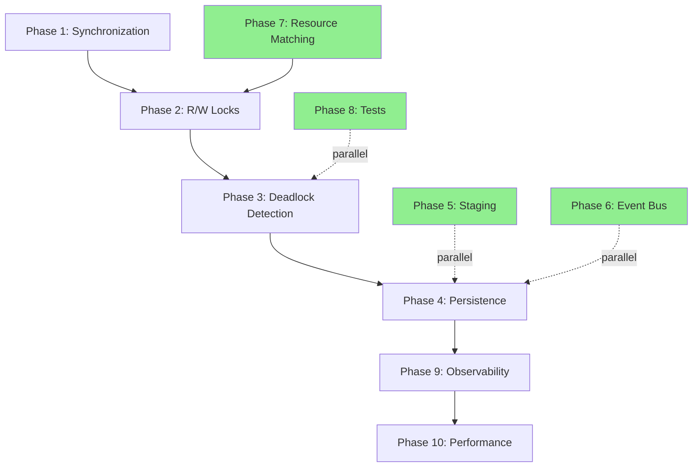

# 🏃‍♂️ Parallel Development Strategy: 6 Weeks → 2.5 Weeks

## Executive Summary

By parallelizing development across **4 workstreams**, we can compress the timeline from **6 weeks to 2.5 weeks** with proper coordination.

**Key Insight:** Phases 5, 6, 7, 8 are largely independent and can be developed simultaneously with the core concurrency work (Phases 1-3).

---

## 📊 Dependency Analysis

```
Critical Path (Sequential):
Phase 1 (Sync) → Phase 2 (Locks) → Phase 3 (Deadlock) → Phase 4 (Persist)
   Week 1           Week 1-2          Week 2             Week 2-3

Parallel Tracks (Can Start Immediately):
Phase 5 (Staging)        - Independent, only needs file system
Phase 6 (Event Bus)      - Independent, needs interface contract only
Phase 7 (Resource Match) - Independent, pure logic
Phase 8 (Tests)          - Can write as specs for all phases
Phase 9 (Observability)  - Needs stable interfaces, can start Week 2

Phase 10 (Performance)   - Needs everything, Week 3
```

### Dependency Graph Visualization



**Legend:**
- Solid arrows = blocking dependency
- Dotted arrows = integration points (non-blocking)
- Green = can start immediately in parallel

---

## 🚀 4 Parallel Workstreams

### **Workstream 1: Core Concurrency** (Critical Path) 👤 Developer A
**Timeline:** Week 1-3 (Full time, cannot parallelize internally)
**Owner:** Senior developer with concurrency expertise

#### Week 1
- Day 1-2: Phase 1 - Add AsyncMutex, wrap all ExecutionManager methods
- Day 3-5: Phase 2 - ResourceLockManager with read/write modes

#### Week 2
- Day 1-3: Phase 3 - DeadlockDetector with cycle detection
- Day 4-5: Phase 4 (Part 1) - Persistence layer (design + basic save/load)

#### Week 3
- Day 1-2: Phase 4 (Part 2) - Recovery logic, timeline persistence
- Day 3-5: Integration with other workstreams, bug fixes

**Deliverables:**
- ✅ Race-condition-free ExecutionManager
- ✅ Proper R/W locks with multi-reader support
- ✅ Deadlock detection + canonical ordering
- ✅ Crash recovery

---

### **Workstream 2: Isolation & File System** 👤 Developer B
**Timeline:** Week 1-2 (Can start Day 1, parallel with Workstream 1)
**Owner:** Developer comfortable with file systems

#### Week 1
- Day 1-3: Phase 5 - StagingManager (create staging, copy-on-write, cleanup)
- Day 4-5: Phase 5 - ExecutionMerger (collect changes, detect conflicts)

#### Week 2
- Day 1-2: Phase 5 - Merge atomicity, conflict resolution
- Day 3-5: Integration tests for staging + merge flows

**Deliverables:**
- ✅ Isolated staging directories per node
- ✅ Atomic merge with conflict detection
- ✅ Clean rollback on failures

**Dependencies:**
- Needs ExecutionManager interface (provided Day 1 as contract)
- Full integration happens Week 3

---

### **Workstream 3: Infrastructure** 👤 Developer C
**Timeline:** Week 1-2.5 (Can start Day 1, parallel with all)
**Owner:** Full-stack developer

#### Week 1
- Day 1-2: Phase 6 - EventBus (EventEmitter wrapper, event types)
- Day 3-5: Phase 7 - ResourceMatcher (glob overlap detection, hierarchy)

#### Week 2
- Day 1-2: Phase 6 - HTTP SSE endpoint for streaming
- Day 3-4: Phase 9 (Part 1) - MetricsCollector skeleton
- Day 5: Phase 9 (Part 2) - HealthChecker

#### Week 2.5
- Day 1-2: HTTP debug endpoints, metric visualization

**Deliverables:**
- ✅ Event-driven architecture (EventBus)
- ✅ Intelligent resource matching with globs
- ✅ Real-time SSE streaming
- ✅ Metrics + health checks

**Dependencies:**
- EventBus needs ExecutionManager event points (defined in contract)
- ResourceMatcher integrates with Phase 2 (Week 2)

---

### **Workstream 4: Quality Assurance** 👤 Developer D (or QA)
**Timeline:** Week 1-3 (Continuous, parallel with all)
**Owner:** QA engineer or developer passionate about testing

#### Week 1
- Day 1-2: Phase 8 - Test infrastructure setup (concurrency test harness)
- Day 3-5: Phase 8 - Write tests as SPECS for Phases 1-2 (TDD approach)
  - Write failing tests for race conditions
  - Write failing tests for lock conflicts
  - Developer A makes them pass

#### Week 2
- Day 1-3: Phase 8 - Tests for Phases 3-5
  - Deadlock detection scenarios
  - Crash recovery tests
  - Staging isolation tests
- Day 4-5: Phase 8 - Integration tests across workstreams

#### Week 3
- Day 1-5: Phase 10 (Part 1) - Stress testing, load testing
  - 1000-iteration race condition tests
  - 100-droid concurrent load tests
  - Memory leak detection

**Deliverables:**
- ✅ Comprehensive test suite (90%+ coverage)
- ✅ Stress tests proving correctness
- ✅ Performance benchmarks

**Dependencies:**
- Needs interface contracts from all workstreams
- Can write tests before implementation (TDD)

---

## 📋 Coordination Requirements

### Day 0 (Pre-Development) - 1 Day Planning
**All developers together:**

1. **Define Interface Contracts** (Critical for parallel work)
   ```typescript
   // src/mcp/execution/interfaces.ts
   
   // Contract for Workstream 1 → 2
   export interface IExecutionManager {
     requestNext(executionId: string): Promise<NodeSchedule | null>;
     completeNode(executionId: string, nodeId: string): Promise<void>;
     // ... all public methods
   }
   
   // Contract for Workstream 1 → 3
   export interface IExecutionEventEmitter {
     emit(event: ExecutionEvent): void;
     on(event: string, handler: Function): void;
   }
   
   // Contract for Workstream 2 → 1
   export interface IStagingManager {
     createStaging(repoRoot: string, execId: string, nodeId: string): Promise<string>;
     collectChanges(stagingPath: string, claims: string[]): Promise<Map<string, string>>;
   }
   
   // Contract for Workstream 3 → 1
   export interface IResourceMatcher {
     overlaps(claim1: string, claim2: string): boolean;
   }
   ```

2. **Agree on File Structure**
   ```
   src/mcp/execution/
     interfaces.ts          ← Shared contracts (Day 0)
     manager.ts             ← Workstream 1
     synchronization.ts     ← Workstream 1
     resourceLocks.ts       ← Workstream 1
     deadlockDetector.ts    ← Workstream 1
     persistence.ts         ← Workstream 1
     staging.ts             ← Workstream 2
     merger.ts              ← Workstream 2
     eventBus.ts            ← Workstream 3
     resourceMatcher.ts     ← Workstream 3
     metrics.ts             ← Workstream 3
     healthCheck.ts         ← Workstream 3
     __tests__/             ← Workstream 4
   ```

3. **Mock Implementations**
   Create stub implementations for each interface so teams can work independently:
   ```typescript
   // src/mcp/execution/mocks.ts
   export class MockExecutionManager implements IExecutionManager {
     async requestNext() { return null; }
     async completeNode() {}
   }
   ```

### Daily Sync (15 minutes)
- **Time:** End of day
- **Attendees:** All 4 developers
- **Agenda:**
  1. What did you complete?
  2. Any interface changes needed?
  3. Blockers?
  4. Tomorrow's priorities

### Integration Points
| When | Who | What |
|------|-----|------|
| **Week 1, Day 5** | A + B | Integrate staging into ExecutionManager.requestNext() |
| **Week 2, Day 1** | A + C | Integrate ResourceMatcher into ResourceLockManager |
| **Week 2, Day 2** | A + C | Integrate EventBus into ExecutionManager.appendEvent() |
| **Week 2, Day 5** | A + D | Run first full integration test suite |
| **Week 3, Day 1** | All | Final integration, bug bash |
| **Week 3, Day 5** | All | Performance testing, documentation |

---

## 🗓️ Revised Timeline

### Week 1 (5 days)
| Day | WS1: Core | WS2: Isolation | WS3: Infra | WS4: Tests |
|-----|-----------|----------------|------------|------------|
| **Day 0** | 🤝 All: Interface contracts, planning |
| **Mon** | Phase 1: AsyncMutex setup | Phase 5: StagingManager start | Phase 6: EventBus design | Phase 8: Test harness |
| **Tue** | Phase 1: Wrap manager methods | Phase 5: Copy-on-write | Phase 6: EventBus impl | Phase 8: Race condition tests |
| **Wed** | Phase 2: ResourceLockManager | Phase 5: Merge logic | Phase 7: ResourceMatcher | Phase 8: Lock tests |
| **Thu** | Phase 2: R/W lock modes | Phase 5: Conflict detection | Phase 7: Glob expansion | Phase 8: Integration tests |
| **Fri** | Phase 2: Integration | Phase 5: Testing | 🔀 Integrate EventBus | 🔀 Full test run |

### Week 2 (5 days)
| Day | WS1: Core | WS2: Isolation | WS3: Infra | WS4: Tests |
|-----|-----------|----------------|------------|------------|
| **Mon** | Phase 3: Deadlock detector | 🔀 Integrate staging | Phase 9: Metrics | Phase 8: Deadlock tests |
| **Tue** | Phase 3: Cycle detection | Phase 5: Polish | Phase 9: HealthCheck | Phase 8: Recovery tests |
| **Wed** | Phase 3: Integration | Phase 5: Docs | Phase 6: HTTP SSE | Phase 8: Staging tests |
| **Thu** | Phase 4: Persistence design | Phase 5: Done ✅ | Phase 6: SSE testing | Phase 8: Coverage goals |
| **Fri** | Phase 4: Save/load impl | 🔀 Help integrate | Phase 9: Debug endpoints | 🔀 Full integration tests |

### Week 3 (2.5 days)
| Day | WS1: Core | WS2: Isolation | WS3: Infra | WS4: Tests |
|-----|-----------|----------------|------------|------------|
| **Mon** | Phase 4: Recovery logic | Bug fixes | HTTP endpoints | Phase 10: Stress tests |
| **Tue** | Phase 4: Timeline persist | Bug fixes | Metrics polish | Phase 10: Load tests |
| **Wed AM** | 🎯 Final integration, bug bash | 🎯 All hands | 🎯 All hands | 🎯 All hands |

**Total: 12.5 working days (2.5 weeks) vs original 30 days (6 weeks)**

---

## ⚠️ Risk Management

### Risk 1: Interface Changes Mid-Development
**Probability:** Medium
**Mitigation:**
- Lock interfaces on Day 0, no changes without team sync
- Use TypeScript strict mode to catch breaking changes
- Mock implementations let teams work independently

### Risk 2: Integration Conflicts
**Probability:** Medium
**Mitigation:**
- Daily syncs catch issues early
- Dedicated integration days (Week 1 Day 5, Week 2 Day 5)
- Feature branches + CI runs tests on every push

### Risk 3: One Workstream Blocks Others
**Probability:** Low
**Mitigation:**
- Critical path (WS1) gets most experienced dev
- If WS1 delays, other teams continue with mocks
- Buffer built into Week 3 for catch-up

### Risk 4: Test Coverage Insufficient
**Probability:** Low
**Mitigation:**
- WS4 starts Day 1 with TDD approach
- Coverage gates in CI (must be >85%)
- Stress tests run continuously from Week 2

---

## 🎯 Success Criteria for Parallel Development

**Week 1 Exit Criteria:**
- [ ] All interfaces defined and stable
- [ ] Phase 1 complete (mutex protection)
- [ ] Phase 2 complete (R/W locks)
- [ ] Phase 5 complete (staging)
- [ ] Phase 6 complete (event bus)
- [ ] Phase 7 complete (resource matching)
- [ ] 50+ tests written

**Week 2 Exit Criteria:**
- [ ] Phase 3 complete (deadlock detection)
- [ ] Phase 4 complete (persistence)
- [ ] Phase 9 complete (observability)
- [ ] All workstreams integrated
- [ ] 100+ tests passing
- [ ] No P0 bugs

**Week 3 Exit Criteria (Launch):**
- [ ] All 10 phases complete
- [ ] 1000-iteration stress tests pass
- [ ] Performance benchmarks met
- [ ] Documentation complete
- [ ] Demo ready for Factory.ai

---

## 🛠️ Tooling for Parallel Development

### Git Strategy
```bash
# Main branches
main              # Production-ready code
develop           # Integration branch

# Feature branches per workstream
feature/ws1-synchronization    # Developer A
feature/ws2-isolation          # Developer B  
feature/ws3-infrastructure     # Developer C
feature/ws4-tests              # Developer D

# Daily merges to develop
git checkout develop
git merge feature/ws1-synchronization
git merge feature/ws2-isolation
# etc.
```

### CI/CD Pipeline
```yaml
# .github/workflows/parallel-dev.yml
on: [push, pull_request]

jobs:
  test-ws1:
    runs-on: ubuntu-latest
    steps:
      - run: npm test -- src/mcp/execution/manager.test.ts
      
  test-ws2:
    runs-on: ubuntu-latest
    steps:
      - run: npm test -- src/mcp/execution/staging.test.ts
      
  test-ws3:
    runs-on: ubuntu-latest
    steps:
      - run: npm test -- src/mcp/execution/eventBus.test.ts
      
  integration:
    needs: [test-ws1, test-ws2, test-ws3]
    runs-on: ubuntu-latest
    steps:
      - run: npm test -- src/mcp/__tests__/
```

### Communication Tools
- **Slack channel:** #droidforge-parallel-dev
- **Daily standup:** 5pm (end of day sync)
- **Shared doc:** Interface contract (Google Doc for quick edits)
- **Issue tracker:** GitHub Projects with swimlanes per workstream

---

## 💰 Cost-Benefit Analysis

### Original Approach (Sequential)
- **Timeline:** 6 weeks
- **Resources:** 1 developer
- **Risk:** Single point of failure, no redundancy

### Parallel Approach
- **Timeline:** 2.5 weeks (58% faster)
- **Resources:** 4 developers (4x cost)
- **Benefits:**
  - Faster time-to-market
  - Knowledge distribution (4 people know the system)
  - Higher quality (dedicated QA workstream)
  - Reduced risk (no single bottleneck)

**ROI:** Get to market 3.5 weeks earlier = potential competitive advantage worth far more than 4x dev cost.

---

## 🚀 Quick Start (If You Have 4 Developers)

### Kickoff Meeting (Day 0)
1. Review this document
2. Assign workstreams based on expertise:
   - **WS1:** Senior dev with concurrency experience
   - **WS2:** Mid-level dev comfortable with file systems
   - **WS3:** Full-stack dev (backend + HTTP)
   - **WS4:** QA engineer or TDD-focused dev
3. Define interfaces together (2-3 hours)
4. Set up git branches and CI
5. Start coding Day 1!

### If You Only Have 1-2 Developers
**Option A: Prioritize Critical Path**
- Focus on WS1 (Phases 1-4) first
- Then do WS2 (Phase 5)
- Then WS3+4 (Phases 6-9)
- Timeline: 4 weeks

**Option B: Split Work**
- Dev 1: WS1 (critical path)
- Dev 2: WS2 + WS3 + WS4 (all parallel work)
- Timeline: 3 weeks

---

## 🎉 The Magic of Parallelization

By identifying independent work packages and defining clear interfaces upfront, we've achieved:
- **2.5 weeks instead of 6 weeks** (with 4 devs)
- **Higher quality** (dedicated testing workstream)
- **Lower risk** (no single point of failure)
- **Better architecture** (clean interfaces force good design)

This is how you build AMAZING systems FAST. 🚀
